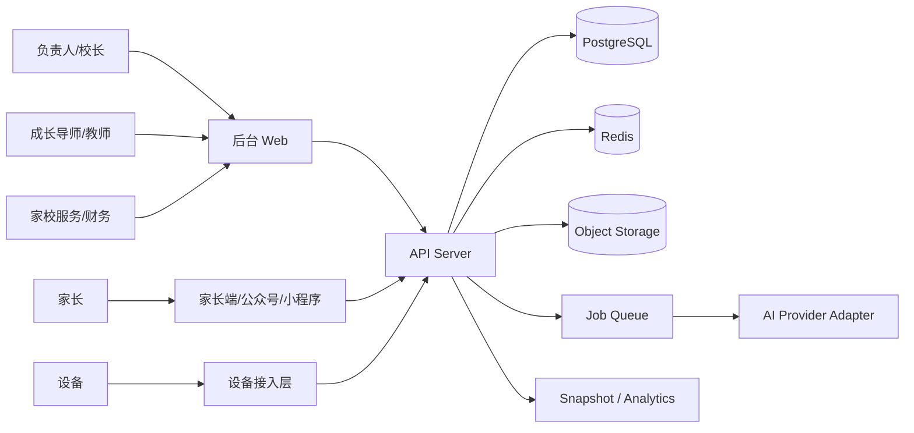
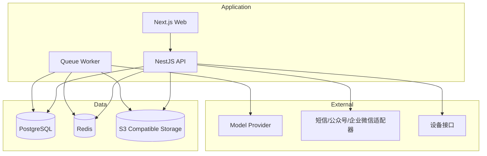

# 01 系统架构

## 1. 架构结论

采用 **DDD 风格的模块化单体**，而不是微服务。

原因：
- 当前业务复杂度主要来自**数据对象多、流程链路长**，不是流量规模
- 模块化单体更适合快速闭环：学生、家庭、教师、作业、成长、收费一体联调
- 对 vibe coding 更友好：单仓、单语言、单部署、低沟通成本

## 2. 系统上下文

## 3. 模块划分

| 模块 | 说明 | 是否 MVP |
|---|---|---|
| auth | 登录、鉴权、角色、数据域 | 是 |
| settings | 校区、学期、字典、模板、任务中心 | 是 |
| teachers | 教师档案、学科能力、班次、发展记录 | 是 |
| students | 学生主档、在读档、标签、导入 | 是 |
| families | 家庭档案、监护人、家庭任务、会谈 | 是 |
| homework | 作业上传、AI 分析、教师复核、错因词典 | 是 |
| growth | Rubric、观察、目标、表扬、报告 | 是 |
| attendance | 设备、签到、作业时长 | 是 |
| billing | 产品、合同、账单、支付、退款、续费 | 是 |
| communication | 家校沟通、消息模板、发送记录 | 是 |
| analytics | 校区总览、教学、成长、收费看板 | 是 |

## 4. 推荐部署拓扑

## 5. 关键技术决策

### 5.1 数据组织
- PostgreSQL 为唯一业务真源
- Redis 只做缓存、队列和短时幂等键
- 报告和 AI 原始输出保留 Markdown / JSON 双存
- 文件统一进对象存储，不直接落数据库

### 5.2 AI 集成
- AI 通过 `AI Adapter` 统一接入
- AI 任务只处理：
  - 作业图像解析
  - 结构化错因归类
  - 家长反馈草稿
  - 周/月报告草稿
- 所有对外内容必须经过教师或运营人工确认

### 5.3 前端组织
- App Router + server actions 不作为主数据写入通道
- 所有业务写操作仍走 REST API
- 页面以“列表页 / 详情页 / 工作台页 / 设置页”四类为主

### 5.4 后端组织
- 以 Nest module 划分领域
- 控制器只做协议转换
- Service 只编排用例
- Repository/ORM 处理持久化
- 需要强一致的写操作统一走事务

## 6. 事件驱动点

即便是模块化单体，也要保留领域事件，便于解耦。

| 事件 | 触发时机 | 订阅动作 |
|---|---|---|
| StudentCreated | 创建学生主档后 | 初始化时间线、默认标签 |
| EnrollmentChanged | 在读档变更后 | 更新教师工作量、班组统计 |
| HomeworkUploaded | 作业提交后 | 入 AI 队列 |
| HomeworkAnalyzed | AI 完成后 | 更新待复核队列 |
| HomeworkReviewed | 教师复核后 | 写入成长趋势、生成家长反馈草稿 |
| GrowthObservationCreated | 新增成长观察后 | 更新目标进度、周报素材池 |
| GrowthReportPublished | 报告发布后 | 生成消息任务 |
| InvoiceIssued | 账单生成后 | 进入催缴提醒池 |
| PaymentRecorded | 收款成功后 | 刷新应收余额 |
| AttendanceEventCaptured | 签到写入后 | 更新今日到校看板 |

## 7. 核心业务链路

### 7.1 学生主档链路
学生 -> 家庭 -> 监护人 -> 在读档 -> 老师/班组 -> 标签/时间线

### 7.2 作业诊断链路
作业上传 -> 文件入库 -> AI 分析 -> 教师复核 -> 错因标准化 -> 家长反馈 -> 成长趋势沉淀

### 7.3 成长管理链路
Rubric 模板 -> 观察记录 -> 目标 -> 家庭任务 -> 周/月报告 -> 家长沟通

### 7.4 收费链路
产品 -> 合同 -> 账单 -> 支付/退款 -> 余额 -> 续费跟进

### 7.5 出勤链路
设备绑定 -> 签到事件 -> 作业时长 -> 每日统计 -> 异常提醒

## 8. 非功能要求

| 类型 | 要求 |
|---|---|
| 性能 | 常规列表 P95 < 800ms；详情页 P95 < 1200ms；看板 P95 < 3000ms |
| 可用性 | 工作时间可用性 >= 99.5% |
| 可维护性 | 前后端统一 TypeScript；接口来源唯一为 OpenAPI |
| 扩展性 | 支持多校区、多学期、多角色 |
| 可追踪性 | 关键写操作、AI 任务、支付事件均可追踪 |
| 安全性 | JWT + Refresh Token；密码哈希；操作日志；字段级隐藏能力 |
| 导入能力 | 支持历史 Excel 转 staging 再入正式表 |
| 幂等性 | 支付、签到、AI 任务、批量导入需要幂等控制 |

## 9. 不做的复杂化设计

- 不做微服务
- 不做事件溯源
- 不做复杂 BPM 引擎
- 不做全文搜索中台
- 不做多数据库分片
- 不做自研低代码平台

## 10. 推荐实现优先级

1. 基础组织与鉴权
2. 学生/家庭/教师主数据
3. 作业 AI 与教师复核
4. 成长观察与周报
5. 收费闭环
6. 设备/签到/作业时长
7. 消息中心与分析看板
