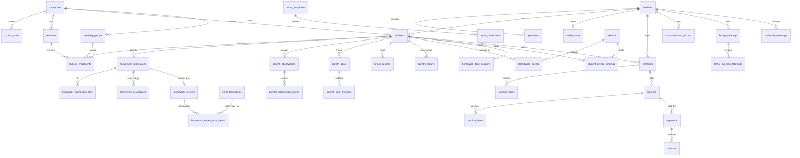
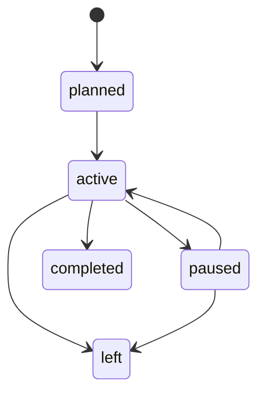
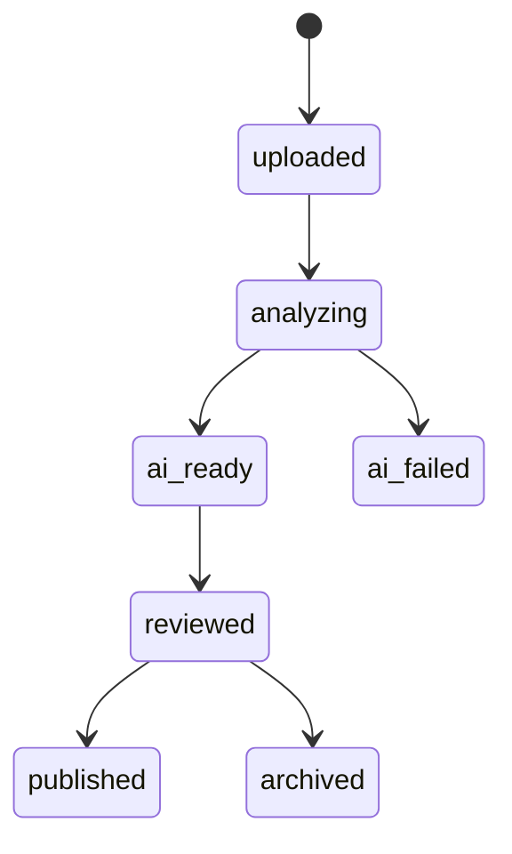
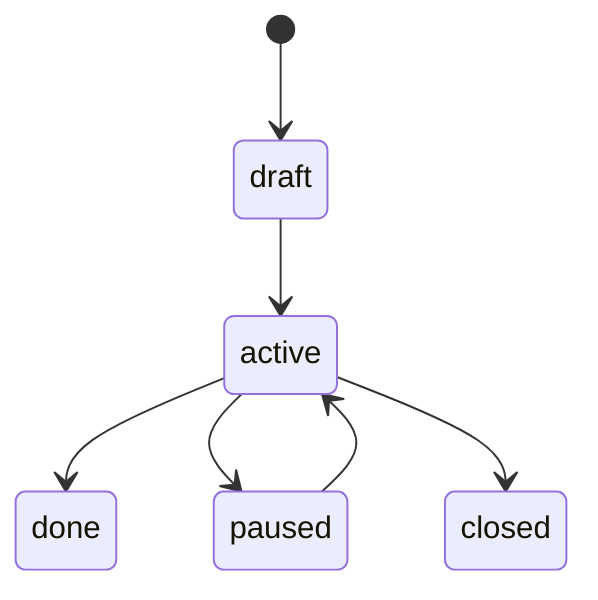
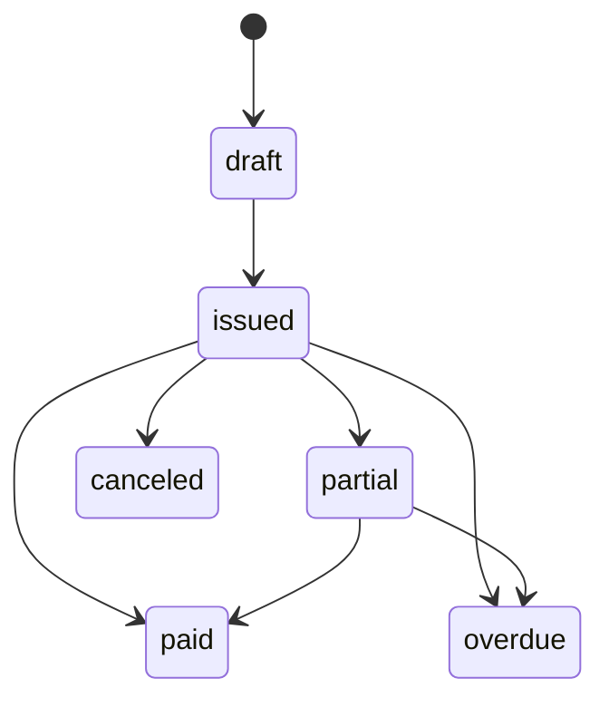

# 03 领域模型与信息架构

## 1. 菜单信息架构

```text
Dashboard
Students
  ├─ Student List
  ├─ Student 360
  └─ Import Center
Families
  ├─ Family List
  ├─ Family Detail
  └─ Family Tasks / Meetings
Teachers
  ├─ Teacher List
  ├─ Teacher Detail
  └─ Shifts / Development
Homework
  ├─ Submission Queue
  ├─ Review Workbench
  └─ Error Taxonomy
Growth
  ├─ Observations
  ├─ Goals
  ├─ Reports
  └─ Rubric Templates
Attendance
  ├─ Attendance Board
  ├─ Devices & Bindings
  └─ Homework Time
Billing
  ├─ Products
  ├─ Contracts
  ├─ Invoices
  └─ Renewals
Communication
  ├─ Records
  ├─ Templates
  └─ Messages
Analytics
  ├─ Overview
  ├─ Teaching
  ├─ Growth
  └─ Billing
Settings
  ├─ Campuses & Terms
  ├─ Users & Roles
  ├─ Dictionaries
  └─ AI Jobs
```

## 2. 角色与数据域

| 角色 | 可见范围 | 关键权限 |
|---|---|---|
| super_admin | 全平台 | 全部 |
| campus_admin | 所属校区 | 组织配置、全校区业务 |
| growth_advisor | 所属校区 / 带学生 | 学生、家庭、成长、报告 |
| subject_teacher | 所属校区 / 带学生 | 作业、观察、部分学生详情 |
| service_staff | 所属校区 | 家庭、沟通、续费 |
| finance | 所属校区 | 产品、合同、账单、支付 |
| receptionist | 所属校区 | 签到、设备、基础查询 |

## 3. 页面与领域对象映射

| 页面 | 核心对象 | 次级对象 |
|---|---|---|
| Student List | student | enrollment, family, tags |
| Student 360 | student | family, homework, growth, billing, attendance |
| Family Detail | family | guardian, student, communication, meeting, task |
| Teacher Detail | teacher | subjects, shifts, development, student workload |
| Review Workbench | homework_submission | homework_ai_analysis, homework_review, error_taxonomy |
| Growth Reports | growth_report | growth_observation, goal, praise, family_task |
| Invoices | invoice | payment, refund, adjustment |
| Attendance Board | attendance_event | device, student |
| Analytics | snapshots/views | all domain summaries |

## 4. 核心实体关系图



## 5. 关键状态机

### 5.1 学生在读档


### 5.2 作业提交


### 5.3 成长目标


### 5.4 账单


## 6. 学生 360 组成

学生 360 不是新对象，而是下列聚合视图：

- 基础信息：student
- 当前在读：latest active enrollment
- 家庭信息：family + guardians
- 作业趋势：近 7/30 天 homework reviews
- 成长趋势：近 7/30 天 observation scores + goals
- 出勤与时长：attendance events + homework time stats
- 收费摘要：合同、应收、已收、未收
- 沟通时间线：communication, meetings, messages, reports

## 7. 统一过滤器规范

所有列表页遵守统一筛选语义：

| 字段 | 含义 |
|---|---|
| keyword | 模糊搜名称/编号/手机号 |
| campusId | 校区 |
| termId | 学期 |
| teacherId | 老师 |
| grade | 年级 |
| status | 状态 |
| dateFrom/dateTo | 时间范围 |
| pageNo/pageSize | 分页 |
| sortBy/sortOrder | 排序 |

## 8. 列表页统一交互约束

1. 顶部统计条
2. 筛选栏
3. 主表格
4. 批量操作区
5. 导出按钮
6. 行级快捷动作
7. 右侧抽屉或弹窗用于轻编辑

## 9. 命名约束

### URL 命名
- 使用英文复数名词：`/students`、`/families`、`/homework/submissions`

### 表名命名
- 使用 snake_case 复数表名：`students`、`growth_goals`

### 前端组件命名
- 列表：`StudentListPage`
- 详情：`StudentDetailPage`
- 表单：`StudentForm`
- 抽屉：`StudentEditDrawer`
- hooks：`useStudentsQuery`

## 10. 指标口径建议

| 指标 | 口径 |
|---|---|
| 作业复核时效 | 作业上传到 review.reviewed_at 的小时差 |
| 成长观察覆盖率 | 当周有 observation 的 active student / active student 总数 |
| 周报发布率 | 已发布 weekly report / 应发布 student 数 |
| 家庭任务完成率 | status=done 的 family_task / 已创建 family_task |
| 未收余额 | issued/partial/overdue 发票金额 - 已支付金额 |
