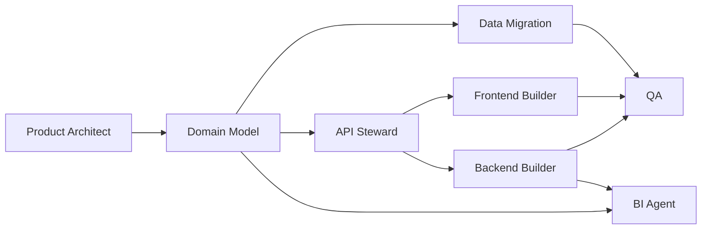

# 11 Agent 团队设计

> 本文分两层：**交付侧 Agent**（用于把系统做出来）和 **运行时 Agent**（系统内实际使用的 AI 助手）。

## 1. 交付侧 Agent

| Agent | 目标 | 输入 | 输出 | Done 标准 |
|---|---|---|---|---|
| Product Architect Agent | 冻结范围和模块边界 | `01` `02` | 需求边界、MVP、验收标准 | 模块和 KPI 无冲突 |
| Domain Model Agent | 固化实体、字段、状态机 | `03` `04` `05` | ERD、DDL、迁移映射 | 表结构稳定 |
| API Steward Agent | 统一接口契约 | `06` `07` | OpenAPI、DTO 草案 | 前后端字段一致 |
| Frontend Builder Agent | 搭页面骨架和通用组件 | `08` `09` `07` | routes、pages、forms、tables | 页面能跑通静态流程 |
| Backend Builder Agent | 实现模块服务和接口 | `05` `06` `07` `10` | modules、service、repo、tests | 主要接口可联调 |
| Data Migration Agent | 清洗历史 Excel | `13` `05` | 导入脚本、校验报告 | 历史数据入库通过 |
| QA Agent | 回归、接口、流程验证 | 全部 | 测试用例、缺陷单 | P0/P1 缺陷清零 |
| BI Agent | 建快照和分析口径 | `03` `05` | 聚合查询、指标口径 | 看板口径统一 |

## 2. 交付顺序



## 3. 推荐协作协议

### 3.1 输入/输出必须文件化
每个 Agent 只接收文档，不接收口头需求。

### 3.2 所有字段以 OpenAPI 和 DDL 为准
发生冲突时优先顺序：
1. `05_数据库DDL.sql`
2. `07_OpenAPI.yaml`
3. 其他 Markdown

### 3.3 每个 Agent 输出格式
```yaml
agent: Backend Builder Agent
module: homework
input_docs:
  - 05_数据库DDL.sql
  - 06_API文档.md
  - 07_OpenAPI.yaml
output:
  - src/modules/homework/**
done_definition:
  - endpoint pass
  - tests pass
  - lint pass
```

## 4. 运行时 Agent

| Agent | 触发时机 | 输入 | 输出 | 人工确认 |
|---|---|---|---|---|
| Homework Parsing Agent | 作业上传后 | 图片、学科、年级 | AI 结构化诊断草稿 | 需要教师复核 |
| Parent Feedback Draft Agent | 作业复核后 | 最终错因、建议 | 家长可见反馈草稿 | 需要教师确认 |
| Report Draft Agent | 周报/月报生成时 | 作业、观察、目标、表扬 | 报告草稿 | 需要成长导师确认 |
| Renewal Reminder Agent | 合同临近到期 | 合同、余额、沟通历史 | 跟进建议和消息草稿 | 需要服务/财务确认 |

## 5. 运行时 Agent 输入 Schema 建议

### Homework Parsing Agent
```json
{
  "submissionId": "uuid",
  "studentName": "string",
  "gradeLabel": "string",
  "subject": "math",
  "imageUrls": ["..."],
  "promptVersion": "homework-review-v3"
}
```

### Parent Feedback Draft Agent
```json
{
  "studentName": "string",
  "subject": "math",
  "finalAccuracyPct": 85,
  "finalErrorSummary": "概念混淆、审题偏差",
  "finalSuggestion": "string"
}
```

### Report Draft Agent
```json
{
  "studentId": "uuid",
  "periodKey": "2026-W13",
  "homeworkSummary": {},
  "growthObservations": [],
  "goals": [],
  "praiseRecords": [],
  "familyTasks": []
}
```

## 6. 运行时 Agent 输出约束

1. 输出必须结构化，优先 JSON，其次 Markdown
2. 不得直接写正式结果表，只能写 draft
3. 必须携带：
   - provider
   - model_name
   - model_version
   - prompt_version
   - generated_at

## 7. 推荐 Prompt Contract

### 系统提示结构
- 角色
- 输入字段定义
- 输出 JSON Schema
- 禁止事项
- 语言要求
- 风格要求

### 关键约束
- 不得输出无法追溯的结论
- 不得把建议写成判定
- 不得输出与年级不匹配的家长措辞
- 不得泄露内部字段名

## 8. 用于 vibe coding 的 Agent 执行节奏

### Sprint 1
- Product Architect
- Domain Model
- API Steward

### Sprint 2
- Backend Builder
- Frontend Builder
- QA

### Sprint 3
- Data Migration
- BI Agent
- Runtime Agent 接入

## 9. 最低可运行 Agent 集合

如果团队资源有限，只保留以下 4 个即可：
- Product Architect Agent
- API Steward Agent
- Backend Builder Agent
- Frontend Builder Agent
