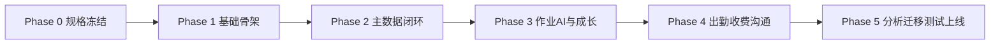

# 15 多 Agent 协作任务总文件

> 用途：把 `11_Agent团队设计.md` 的角色分工，与 `12_开发任务Todo.md` 的 WBS 待办，收口成一个可直接用于多 Agent 并行开发的总控文件。
> 目标：减少重复沟通，明确谁先做、谁并行做、谁给谁交付、什么算完成。

---

## 1. 文档定位

这不是新的需求文档，而是**交付编排文档**。

它解决 4 个问题：
1. 哪些 Agent 先上，哪些后上
2. 哪些任务可以并行，哪些必须等依赖
3. 每个 Agent 的输入、输出、边界、DoD 是什么
4. 多 Agent 交接时，什么内容必须文件化

---

## 2. 单一事实源（Source of Truth）

发生冲突时，统一按以下优先级执行：

1. `05_数据库DDL.sql`
2. `07_OpenAPI.yaml`
3. `06_API文档.md`
4. `08_页面原型清单.md`
5. `09_前端开发规格.md`
6. `10_后端开发规格.md`
7. `02_PRD.md`
8. 其他 Markdown

**硬规则：**
- 表结构以 DDL 为准，不允许前后端各自发明字段
- 接口字段以 OpenAPI 为准，不允许页面私改命名
- 页面行为以 `08` 为准，前端不能擅自改业务流程
- 事务边界、幂等、权限，以 `10` 为准

---

## 3. 协作总原则

### 3.1 先冻结，再开工
- `WBS-001 ~ WBS-004` 未完成前，不进入大规模页面/接口开发
- 尤其是 DDL、OpenAPI、命名规范必须先冻结一版

### 3.2 先骨架，再细节
- 先仓库骨架、模块 skeleton、路由骨架
- 再 DTO / Repository / Service / 页面表单 / 复杂事务
- 最后测例、联调、优化

### 3.3 只交付文件化结果
每个 Agent 交付时必须写清楚：
- 改了哪些文件
- 对应哪个 WBS
- 输入文档是什么
- 输出产物是什么
- 还有哪些 blocker / assumption
- 自测是否通过

### 3.4 模块归属清晰
- 后端 Agent 不改前端业务组件
- 前端 Agent 不自行定义接口字段
- QA Agent 不直接改业务逻辑，只提缺陷单；若被授权修复，则要补回归验证
- Data Migration Agent 不直接改正式业务模型定义

### 3.5 Task / Todo 文件默认执行规则
- 进入仓库的 task / todo / 派工 / 验收类文件，默认视为**可执行任务清单**，不是“仅供讨论”的参考材料。
- 只要任务范围属于仓库内部实现、文档、测试、联调、脚手架、迁移脚本、CI/CD 配置等内部交付，Agent 应按依赖顺序**自动推进**，不逐条回头确认。
- Agent 完成任务后，必须把结果回写到交付物、状态字段、handoff 记录或 commit 中，形成可追踪闭环。
- 只有以下情况才暂停并询问：
  1. 外部发送或对外承诺
  2. 删除生产数据 / 不可逆破坏性操作
  3. 涉及新增费用、第三方付费资源、额度消耗
  4. 需求范围发生变化，超出 task 文件原定义
  5. 凭证、权限、法律、合规边界不明确

---

## 4. 建议的多 Agent 实例化方式

`11_Agent团队设计.md` 给的是角色；真正落地时，建议按“角色 + 代码面”实例化。

### 4.1 精简可跑版（6 席）

| 席位 | 对应角色 | 负责范围 |
|---|---|---|
| A1 | Product Architect Agent | 范围冻结、模块边界、验收口径 |
| A2 | API Steward Agent | OpenAPI、DTO、前后端字段统一 |
| A3 | Backend Builder Agent-Base | auth/settings/students/families/files |
| A4 | Backend Builder Agent-Biz | homework/growth/billing/communication/analytics |
| A5 | Frontend Builder Agent | 页面骨架、表单、工作台、看板 |
| A6 | QA + Migration Agent | 历史导入、E2E、回归、上线前验收 |

### 4.2 推荐完整版（10 席）

| 席位 | 对应角色 | 负责范围 |
|---|---|---|
| A1 | Product Architect Agent | 冻结范围 / MVP / 发布边界 |
| A2 | Domain Model Agent | DDL、领域实体、迁移口径 |
| A3 | API Steward Agent | OpenAPI、DTO、错误码、字段一致性 |
| A4 | Backend Builder Agent-Foundation | auth / users / settings / files / jobs |
| A5 | Backend Builder Agent-Core | teachers / students / families |
| A6 | Backend Builder Agent-Biz | homework / growth / attendance |
| A7 | Backend Builder Agent-Finance | billing / communication / analytics |
| A8 | Frontend Builder Agent-Core | login / dashboard / students / families / teachers |
| A9 | Frontend Builder Agent-Biz | homework / growth / attendance / billing / communication / analytics / settings |
| A10 | QA + Data Migration + BI Agent | migration / analytics 校验 / E2E / release 验收 |

> 主协调由人类负责人 + 主会话承担，不额外算一个实现 Agent。

---

## 5. 总执行节奏（建议）



### Phase 0：规格冻结
- WBS-001 ~ WBS-004
- 产出：命名规范、DDL 可执行、OpenAPI 可生成类型、Monorepo 可运行

### Phase 1：基础骨架
- WBS-005 ~ WBS-008
- 产出：登录、权限、系统设置、用户角色基础页面

### Phase 2：主数据闭环
- WBS-009 ~ WBS-018
- 产出：教师 / 学生 / 家庭 / 文件上传基础能力

### Phase 3：作业 AI 与成长闭环
- WBS-019 ~ WBS-032
- 产出：作业上传 -> AI -> 教师复核 -> 观察/目标 -> 报告草稿

### Phase 4：出勤 / 收费 / 沟通
- WBS-033 ~ WBS-044
- 产出：设备绑定、签到、时长、合同、账单、支付、沟通记录、消息中心

### Phase 5：分析 / 迁移 / QA / 上线
- WBS-045 ~ WBS-050
- 产出：看板口径、历史导入、E2E、预发上线方案

---

## 6. 关键依赖关系

### 6.1 绝对前置
- `WBS-001` -> `WBS-002` / `WBS-003` / `WBS-004`
- `WBS-003`（DDL）是几乎全部后端模块前置
- `WBS-004`（OpenAPI 类型）是前端联调前置

### 6.2 主数据前置
- students / families / teachers 是 homework / growth / billing 的底座
- files 上传模块是作业提交前置

### 6.3 作业链路前置
- `WBS-019` -> `WBS-020` -> `WBS-021` -> `WBS-024`
- `WBS-021` 稳定前，复核工作台只做静态/假数据联通

### 6.4 成长链路前置
- `WBS-026` -> `WBS-027` -> `WBS-028` -> `WBS-031/032`

### 6.5 收费链路前置
- `WBS-037` -> `WBS-038` -> `WBS-041`

### 6.6 分析与迁移前置
- analytics 必须依赖 homework/growth/billing/attendance 基础数据结构稳定
- migration 必须等 DDL 稳定，不等全部页面完成

---

## 7. 多 Agent 主任务包（建议作为实际派工单元）

下面不是简单抄 WBS，而是把 WBS 合并成适合 Agent 并行执行的任务包。

### TASK-P0：规格冻结与工程起盘

| 项目 | 内容 |
|---|---|
| 负责人 | A1 Product Architect + A2/A3 配合 |
| 对应 WBS | WBS-001 ~ WBS-004 |
| 输入 | `01` `02` `05` `06` `07` `09` `10` |
| 输出 | 范围冻结结果、Monorepo、DDL 落库方案、OpenAPI 类型生成方案 |
| 前置 | - |
| 并行 | 可由 A1/A2/A4 部分并行 |
| DoD | 仓库可跑、DDL 可执行、OpenAPI 可生成前后端类型 |

**子任务**
- T-P0-1：冻结模块、命名、MVP 范围
- T-P0-2：建立 monorepo、lint、format、CI
- T-P0-3：落 PostgreSQL schema 与 migration 机制
- T-P0-4：导入 OpenAPI，生成 TS types / DTO 基线

---

### TASK-F1：认证、权限、系统设置基础层

| 项目 | 内容 |
|---|---|
| 负责人 | A4 Backend Foundation + A8/A9 Frontend |
| 对应 WBS | WBS-005 ~ WBS-008 |
| 输入 | `01` `02` `06` `07` `08` `09` `10` |
| 输出 | 登录、refresh、current user、权限树、设置接口、用户角色页面 |
| 前置 | TASK-P0 |
| 并行 | 后端 auth/settings 与前端登录/设置页可并行 |
| DoD | 登录可用，权限生效，系统参数 CRUD 可用 |

**子任务**
- T-F1-1：Auth API + token 流程
- T-F1-2：菜单/按钮权限点
- T-F1-3：校区 / 学期 / 字典接口
- T-F1-4：用户与角色页面

---

### TASK-M1：教师、学生、家庭、文件主数据闭环

| 项目 | 内容 |
|---|---|
| 负责人 | A5 Backend Core + A8 Frontend Core |
| 对应 WBS | WBS-009 ~ WBS-018 |
| 输入 | `02` `05` `07` `08` `09` `10` |
| 输出 | teachers / students / families / files 模块，学生列表、学生360、家庭列表、教师列表 |
| 前置 | TASK-P0，建议依赖 TASK-F1 基础登录鉴权 |
| 并行 | teachers、students、families、files 可并行拆开 |
| DoD | 主数据 CRUD 通，学生360 能读到聚合结果，文件上传可回 fileId |

**子任务**
- T-M1-1：教师主表 + 列表/详情
- T-M1-2：学生主档 + 在读档 + 学生列表
- T-M1-3：学生 360 聚合接口 + 页面
- T-M1-4：家庭/监护人 CRUD + 家庭列表/详情
- T-M1-5：文件上传模块

---

### TASK-H1：作业诊断中心闭环

| 项目 | 内容 |
|---|---|
| 负责人 | A6 Backend Biz + A9 Frontend Biz + A2 API Steward |
| 对应 WBS | WBS-019 ~ WBS-025 |
| 输入 | `01` `02` `05` `06` `07` `08` `09` `10` `11` |
| 输出 | 作业提交、AI 任务、AI Adapter、复核工作台、正式复核事务、错因词典页 |
| 前置 | TASK-M1（students/files） |
| 并行 | 前端工作台可先用 mock，后端 AI/事务并行开发 |
| DoD | 上传 -> AI -> 复核 -> 正式提交 全链路打通 |

**子任务**
- T-H1-1：submission 接口
- T-H1-2：AI job 表 + 队列
- T-H1-3：AI Adapter 接口实现
- T-H1-4：作业列表页
- T-H1-5：复核工作台
- T-H1-6：复核提交事务
- T-H1-7：错因词典维护

---

### TASK-G1：成长管理闭环

| 项目 | 内容 |
|---|---|
| 负责人 | A6 Backend Biz + A9 Frontend Biz |
| 对应 WBS | WBS-026 ~ WBS-032 |
| 输入 | `02` `05` `06` `07` `08` `09` `10` `11` |
| 输出 | rubric、观察、目标、报告草稿与发布、对应页面 |
| 前置 | TASK-M1，建议接续 TASK-H1 |
| 并行 | rubric/observation/goal/report 可分两条子线 |
| DoD | 观察记录与目标跟进可用，报告草稿能生成并发布 |

**子任务**
- T-G1-1：Rubric 模板接口 + 页面
- T-G1-2：成长观察接口 + 页面
- T-G1-3：成长目标/跟进接口 + 页面
- T-G1-4：报告草稿 job
- T-G1-5：报告页与发布流程

---

### TASK-A1：出勤与作业时长

| 项目 | 内容 |
|---|---|
| 负责人 | A6 Backend Biz + A9 Frontend Biz |
| 对应 WBS | WBS-033 ~ WBS-036 |
| 输入 | `01` `02` `05` `06` `07` `08` `09` `10` |
| 输出 | devices、bindings、attendance events、time aggregation、出勤看板 |
| 前置 | TASK-M1 |
| 并行 | 设备绑定与签到聚合可并行 |
| DoD | 绑定可追踪、签到可写入、日统计可查、看板可展示 |

---

### TASK-B1：收费与续费闭环

| 项目 | 内容 |
|---|---|
| 负责人 | A7 Backend Finance + A9 Frontend Biz |
| 对应 WBS | WBS-037 ~ WBS-041 |
| 输入 | `01` `02` `05` `06` `07` `08` `09` `10` |
| 输出 | 产品、合同、账单、支付、退款、续费页面与接口 |
| 前置 | TASK-M1 |
| 并行 | 产品/合同 与 账单/支付 可并行，续费跟进后置 |
| DoD | 财务链路完整可追踪，续费任务可管理 |

---

### TASK-C1：沟通与消息中心

| 项目 | 内容 |
|---|---|
| 负责人 | A7 Backend Finance + A9 Frontend Biz |
| 对应 WBS | WBS-042 ~ WBS-044 |
| 输入 | `02` `06` `07` `08` `09` `10` |
| 输出 | communication records、templates、messages、页面 |
| 前置 | TASK-M1，建议依赖 TASK-B1 / TASK-G1 部分事件打通 |
| 并行 | 记录模块与消息模块可并行 |
| DoD | 沟通记录 CRUD 可用，消息草稿/待发/已发状态可追踪 |

---

### TASK-BI1：分析看板与指标口径

| 项目 | 内容 |
|---|---|
| 负责人 | A10 QA+Migration+BI + A7 Backend Finance + A9 Frontend Biz |
| 对应 WBS | WBS-045 ~ WBS-047 |
| 输入 | `01` `02` `03` `05` `08` `09` `10` |
| 输出 | overview / teaching / billing 聚合查询与页面 |
| 前置 | homework / growth / billing / attendance 基础结构稳定 |
| 并行 | 后端聚合与前端图表可并行 |
| DoD | 指标口径统一，图表与筛选联通 |

---

### TASK-DM1：历史数据迁移

| 项目 | 内容 |
|---|---|
| 负责人 | A10 QA+Migration+BI |
| 对应 WBS | WBS-048 |
| 输入 | `05` `13` |
| 输出 | staging 导入脚本、清洗规则、校验报告、首批数据入库结果 |
| 前置 | DDL 稳定 |
| 并行 | 可与后续模块开发并行，但不得破坏正式模型 |
| DoD | 首批样本数据入库通过，错误报告可复盘 |

---

### TASK-QA1：主流程 E2E、上线与回滚

| 项目 | 内容 |
|---|---|
| 负责人 | A10 QA+Migration+BI |
| 对应 WBS | WBS-049 ~ WBS-050 |
| 输入 | 全部实现产物 |
| 输出 | E2E 用例、缺陷清单、预发上线清单、备份回滚方案 |
| 前置 | 各主模块完成 |
| 并行 | 缺陷回归与上线脚本准备可并行 |
| DoD | P0/P1 缺陷清零，主流程 E2E 通过，可上线可回滚 |

---

## 8. 按 Agent 视角的派工清单

## A1 Product Architect Agent

**职责**
- 冻结范围、模块边界、发布边界、P0/P1 验收口径

**负责任务**
- WBS-001
- 支持 TASK-P0、TASK-QA1 验收口径定义

**交付物**
- MVP 范围冻结说明
- 模块边界与验收标准
- 发布阻塞项清单

---

## A2 Domain Model / API Steward Agent

**职责**
- 稳定实体、字段、状态机、OpenAPI、DTO、一致性检查

**负责任务**
- WBS-003
- WBS-004
- 横向参与 WBS-019~050 的字段一致性审查

**交付物**
- DDL 校核结论
- OpenAPI / DTO 基线
- 字段冲突清单
- 错误码与响应结构约束

---

## A4/A5/A6/A7 Backend Builder Agents

### Backend Foundation
- WBS-002, 005, 007, 018
- 模块：auth / users / settings / files / jobs

### Backend Core
- WBS-009, 011, 012, 014, 016
- 模块：teachers / students / families

### Backend Biz
- WBS-019, 020, 021, 024, 026, 027, 028, 031, 033, 034, 035
- 模块：homework / growth / attendance

### Backend Finance
- WBS-037, 038, 041, 042, 043, 045, 046
- 模块：billing / communication / analytics

**统一交付要求**
- 先 skeleton，后 service/repository，最后 tests
- 事务、幂等、领域事件按 `10_后端开发规格.md` 执行
- 聚合查询单独 query repository，不把大 SQL 塞满 service

---

## A8/A9 Frontend Builder Agents

### Frontend Core
- WBS-006, 008, 010, 013, 015, 017
- 页面：登录、设置、教师、学生、家庭主页面

### Frontend Biz
- WBS-022, 023, 025, 029, 030, 032, 036, 039, 040, 044, 047
- 页面：作业、成长、出勤、收费、沟通、分析

**统一交付要求**
- 页面以 `08` 为准，组件约束以 `09` 为准
- 不在页面内直接写 fetch
- 所有表单走 Zod schema
- 学生 360、看板类页面避免前端手算聚合

---

## A10 QA / Data Migration / BI Agent

**职责**
- 历史数据迁移、指标校验、E2E、上线验收

**负责任务**
- WBS-048, WBS-049, WBS-050
- 支持 WBS-045~047 指标校验

**交付物**
- 导入脚本
- 数据校验报告
- E2E 脚本
- 缺陷单
- 上线前 checklist

---

## 9. 建议并行策略

### 9.1 第一波并行（规格冻结）
- A1：范围冻结
- A2：DDL / OpenAPI 校核
- A4：monorepo + CI + 基础工程脚手架

### 9.2 第二波并行（基础层）
- A4：auth/settings/files
- A8：login/settings/users 页面骨架
- A2：接口与 DTO 对齐

### 9.3 第三波并行（主数据层）
- A5：teachers/students/families 后端
- A8：teachers/students/families 前端
- A10：历史数据字段映射预校验

### 9.4 第四波并行（核心业务层）
- A6：homework/growth/attendance 后端
- A7：billing/communication/analytics 后端
- A9：对应业务页面并行推进
- A2：接口契约守门

### 9.5 第五波并行（验收层）
- A10：E2E、迁移、上线清单
- A6/A7/A9：缺陷修复与回归

---

## 10. 推荐交接协议（每次 handoff 必带）

每个 Agent 交付时都按下面模板输出：

```yaml
agent: Backend Builder Agent-Biz
module: homework
wbs:
  - WBS-019
  - WBS-020
  - WBS-021
input_docs:
  - 05_数据库DDL.sql
  - 06_API文档.md
  - 07_OpenAPI.yaml
  - 10_后端开发规格.md
changed_files:
  - apps/api/src/modules/homework/**
  - packages/schema/**
output:
  - submission api
  - ai job queue
  - adapter interface
self_check:
  - lint pass
  - unit test pass
  - openapi aligned
risks:
  - provider adapter 仍为 mock
  - review transaction 未接 analytics event
next_handoff_to:
  - Frontend Builder Agent-Biz
  - QA Agent
```

**不满足这个格式的交付，一律视为半成品。**

---

## 11. 建议的代码边界切分

### 后端目录切分
```text
apps/api/src/modules/
  auth/
  users/
  settings/
  teachers/
  students/
  families/
  homework/
  growth/
  attendance/
  billing/
  communication/
  analytics/
  files/
  jobs/
```

### 前端目录切分
```text
apps/web/src/
  app/
  features/
  services/
  components/business/
```

### 可并行开发的安全边界
- `students` 与 `teachers` 可分开做
- `families` 与 `billing` 可分开做，但 billing 依赖 family/student 关联存在
- `homework` 与 `growth` 可前后接续，但 report 依赖 observation/goal
- `analytics` 后端聚合可晚于页面图表骨架

---

## 12. 发布阻塞项（P0 Gate）

以下任一未完成，都不建议进入正式上线：

1. 登录与权限未稳定
2. 学生主档 + 在读档未跑通
3. 家庭档案未成型
4. 作业上传 -> AI -> 教师复核链路未打通
5. 成长观察 + 目标未可用
6. 合同 + 账单 + 支付未成闭环
7. 历史数据导入未完成首批校验
8. 主流程 E2E 未通过
9. 备份 / 回滚方案未演练

---

## 13. 推荐执行顺序（可直接用于派工）

### Wave 0：基础定版
- A1：WBS-001
- A4：WBS-002
- A2：WBS-003, WBS-004

### Wave 1：基础系统
- A4：WBS-005, WBS-007, WBS-018
- A8：WBS-006, WBS-008

### Wave 2：主数据系统
- A5：WBS-009, 011, 012, 014, 016
- A8：WBS-010, 013, 015, 017

### Wave 3：作业与成长
- A6：WBS-019, 020, 021, 024, 026, 027, 028, 031
- A9：WBS-022, 023, 025, 029, 030, 032

### Wave 4：出勤、收费、沟通
- A6：WBS-033, 034, 035
- A7：WBS-037, 038, 041, 042, 043, 045, 046
- A9：WBS-036, 039, 040, 044, 047

### Wave 5：收尾上线
- A10：WBS-048, 049, 050

---

## 14. 一个实用判断：先做什么最划算

如果现在就开始拉多 Agent 并行，我的判断是：

### 第一优先级
1. `TASK-P0` 规格冻结与仓库起盘
2. `TASK-F1` 登录/权限/设置基础层
3. `TASK-M1` 学生/家庭/教师/文件主数据闭环

### 第二优先级
4. `TASK-H1` 作业诊断中心
5. `TASK-G1` 成长管理

### 第三优先级
6. `TASK-B1` 收费闭环
7. `TASK-A1` 出勤与时长
8. `TASK-C1` 沟通中心

### 最后收口
9. `TASK-BI1` 分析看板
10. `TASK-DM1` 迁移
11. `TASK-QA1` E2E 与上线

一句话：**先把“能建档、能交作业、能复核、能记录成长、能收费”打通，再谈花活。**

---

## 15. 建议下一步

如果要正式进入多 Agent 开发，本文件建议作为总控入口，再补 3 份执行文件：

1. `16_多Agent派工清单.yaml`  
   - 给每个 Agent 的具体任务卡
2. `17_联调与验收清单.md`  
   - 给 QA / PM / 负责人验收
3. `18_分支与提交规范.md`  
   - 给多 Agent 同仓协作避免互踩

这三份补上后，就可以直接拿去驱动多 Agent 编码。
