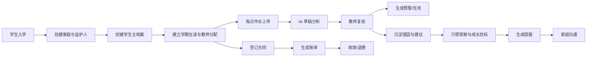
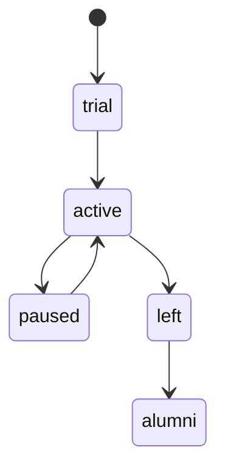
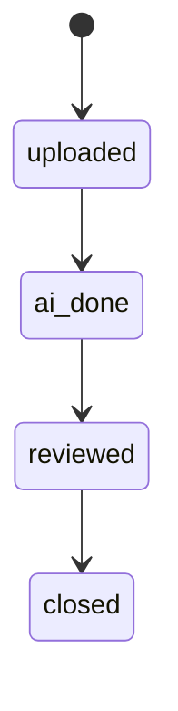
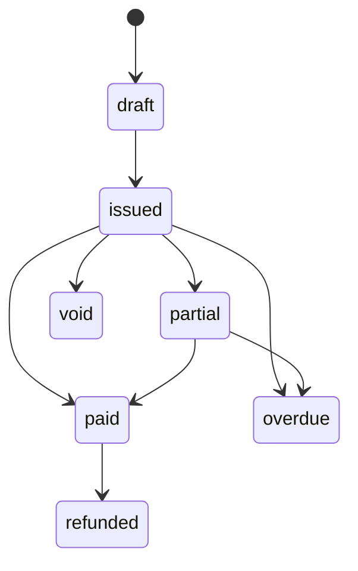
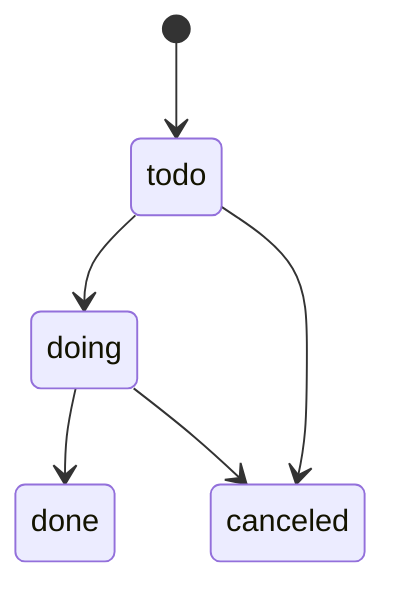

# 02 精简 PRD

## 1. 产品名称
洪基托管成长中心后台管理系统

## 2. 产品目标
围绕“学生成长”而不是“表格录入”重建后台系统，实现以下目标：

1. 用 **学生 360** 统一查看作业、习惯、家庭、收费、任务、预警。
2. 用 **教师工作台** 管理复核任务、学生分配、沟通记录、成长目标。
3. 用 **家庭管理** 管理主联系人、沟通历史、家庭配合建议。
4. 用 **收费中心** 管理收费方案、合同、账单、收款、退费、欠费预警。
5. 用 **标准化结构数据** 替代分散 Excel，使 AI、报表、预警、迁移都可落地。

## 3. 目标用户
| 角色 | 主要目标 | 关键页面 |
| --- | --- | --- |
| 超级管理员 | 基础配置、角色权限、全局维护 | 设置中心、用户角色 |
| 校长/负责人 | 看整体经营和学生成长质量 | 仪表盘、教师分析、学生分析、收费分析 |
| 教务运营 | 管学生、家庭、任务、周报、设备 | 学生中心、家庭中心、任务中心、考勤设备 |
| 教师 | 复核作业、记习惯、定目标、写周报、跟家长沟通 | 教师工作台、作业队列、成长目标、学生 360 |
| 财务 | 合同、账单、收款、退费、欠费提醒 | 收费方案、合同、账单、收款页 |

## 4. 核心成功指标（系统指标）
| 指标 | 目标 |
| --- | --- |
| 学生主档案、家庭、学期在读信息可在 1 个页面闭环查看 | 是 |
| 作业上传到教师复核闭环 | 是 |
| 习惯观察、成长目标、周报形成闭环 | 是 |
| 合同、账单、收款、退费形成闭环 | 是 |
| 任务和预警可追踪负责人、状态、截止时间 | 是 |
| Excel 历史数据可幂等导入 | 是 |

## 5. 核心用户旅程

## 6. 模块需求清单
| 模块 | 核心对象 | 必做功能 | 产出 |
| --- | --- | --- | --- |
| 学生主数据 | 学生、学期在读、标签 | 学生建档、转状态、分配教师、查看 360 | 学生全景档案 |
| 家庭管理 | 家庭、监护人、沟通记录 | 维护联系人、主联系人、沟通记录、家庭建议 | 家庭 360 |
| 教师管理 | 教师、分配、复盘、培训任务 | 教师档案、学生分配、工作量、复盘、培训记录 | 教师 360 |
| 作业管理 | 作业、附件、AI 分析、教师复核 | 上传、AI 解析、标准错因、风险等级、后续动作 | 学业跟进闭环 |
| 成长管理 | 习惯观察、目标、周报 | 维度打分、目标设定、跟进、周报输出 | 成长记录 |
| 设备与时长 | 设备、签到、学习时长 | 设备绑定、签到离校、学习时长记录 | 时长统计 |
| 收费管理 | 收费方案、合同、账单、收款、退费 | 建方案、签约、开账、收款、退费、欠费提醒 | 财务闭环 |
| 任务与预警 | 任务、预警 | 自动/手动建任务、状态流转、提醒 | 执行闭环 |
| 设置中心 | 科目、错因、习惯维度、收费项目 | 基础字典维护 | 系统可配置 |

## 7. 模块级验收标准
### 7.1 学生主数据
- 可以创建学生、家庭、监护人。
- 可以为学生建立学期在读记录。
- 可以为学生指定主负责教师。
- 学生 360 页面必须展示：基本信息、家庭、最近作业、最近习惯观察、成长目标、账单状态、任务、预警。

### 7.2 作业管理
- 支持一次作业上传多张图片。
- AI 分析结果和教师复核结果分开存储。
- 教师可手动修正正确率、错因标签、风险等级、教师建议。
- 教师复核后，系统可根据规则自动创建任务或预警。

### 7.3 成长管理
- 支持习惯维度分项评分。
- 支持按学生创建成长目标和阶段跟进。
- 支持以周为单位生成周报草稿，并人工修改后保存/分享。
- 周报必须至少包含：作业表现、习惯表现、学习时长摘要、家庭建议、教师评语。

### 7.4 教师管理
- 支持教师档案维护。
- 支持查看教师当前负责学生数。
- 支持查看教师作业复核数、家长沟通数、平均学生表现。
- 支持记录教师周复盘与培训任务。

### 7.5 收费管理
- 支持定义收费方案与收费项目。
- 支持把收费方案挂到学生合同。
- 支持从合同生成账单。
- 支持记录多笔收款。
- 支持退费。
- 支持欠费清单与逾期预警。

### 7.6 设备与学习时长
- 支持维护设备 SN。
- 支持学生绑定设备。
- 支持签到离校记录。
- 支持学习时长记录，并关联学生、日期、学科、设备。

## 8. 关键状态机
### 8.1 学生状态

### 8.2 作业状态

### 8.3 账单状态

### 8.4 任务状态

## 9. 主要业务规则
### 9.1 学生编号
- `student_no` 为长期稳定键。
- Excel 导入、合同、设备绑定、账单都优先使用 `student_no` 识别学生。
- 若历史数据没有统一编号，迁移阶段按“姓名 + 学期 + 班型/教师”辅助匹配。

### 9.2 作业复核
- AI 结果不能覆盖教师结果。
- 风险等级必须以教师复核结果为准。
- 错因标签允许多选。
- 一条作业只有一条最终复核记录。

### 9.3 习惯总分
- 维度分数区间固定 1~5。
- 总分 = 各维度分数 * 权重 / 权重和。
- 评分规则可版本化，避免历史数据被新规则污染。

### 9.4 学习时长
- 优先记录分钟数。
- 有开始/结束时间时再反推分钟数。
- 没有开始/结束时间时允许只保存 `duration_minutes`。

### 9.5 账单收款
- 一张账单允许多笔收款。
- `received_amount` 由收款累计得到。
- 当 `received_amount >= receivable_amount` 时账单转 `paid`。
- 退费不直接删除收款，而是新增退款记录。

## 10. 非功能要求
| 类别 | 要求 |
| --- | --- |
| 一致性 | 同一学生在任何模块都用同一 `student_id` |
| 可追踪 | 核心操作可追到操作者和时间 |
| 可迁移 | 支持从 Excel 分批导入并重复执行 |
| 可扩展 | 错因标签、习惯维度、收费项目均可配置 |
| 可统计 | 列表页和分析页都能按学期、教师、年级、状态筛选 |
| 易实现 | 优先 REST + 标准 CRUD，避免过度抽象 |

## 11. MVP 边界
### MVP 必须有
- 学生/家庭/教师
- 作业管理
- 成长管理
- 收费管理
- 设备签到与学习时长
- 任务与预警
- 设置中心
- Excel 导入脚本

### Phase 2 再做
- 家长端
- 微信模板消息/短信
- 更复杂的排课
- 更多 AI 自动化编排
- BI 大屏

## 12. 发布建议
- v0：数据库 + 种子数据 + Swagger + 后台框架
- v1：学生 / 家庭 / 教师 / 设置
- v2：作业 / 成长 / 任务 / 预警
- v3：收费 / 财务
- v4：分析 / 迁移 / 优化
