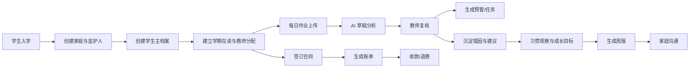

# 洪基托管成长中心 PRD (整合版)

## 1. 产品定义

### 产品名称
洪基托管成长中心后台管理系统

### 产品定位
一套面向课后托管补习机构的 **学生成长中台 + 运营后台**。围绕“学生成长”而不是“表格录入”重建，让大模型或工程团队能直接基于此完成设计与开发。

### 核心价值
- **对学生**：形成跨学期连续成长档案，记录习惯、目标、表扬与长期变化。
- **对家长**：得到可执行的反馈、任务和周/月度成长报告，而非碎片数据。
- **对教师**：利用 AI 降低记录成本，提高复盘质量与家校协同效率。
- **对负责人**：同时看清教学质量、学生成长、出勤情况与收费经营。

---

## 2. 用户角色

| 角色 | 主要目标 | 关键页面 |
|---|---|---|
| **超级管理员** | 基础配置、角色权限、系统全局维护 | 设置中心、用户角色 |
| **校长/负责人** | 看经营与教学全局，配置组织和模板 | 仪表盘、各维分析看板、校区总览 |
| **成长导师/教务** | 维护学生档案、家庭任务、成长观察、报告、考勤设备 | 学生/家庭中心、任务中心、考勤设备 |
| **学科教师** | 上传作业、复核 AI 结果、给出反馈、跟进成长目标 | 教师工作台、作业队列、成长目标、学生 360 |
| **财务** | 产品收费方案、合同、账单、收款、退款 | 收费方案、合同、账单、收款页 |
| **行政/值班** | 签到、设备绑定、异常登记 | 考勤中心 |

---

## 3. 核心成功指标

- **一人一档**：100% 在读学生拥有跨学期连续主档，不再出现重复建档。
- **闭环效率**：作业复核时效 >= 90% 在 24 小时内完成。
- **家校协同**：周报发布率 >= 95%，家庭绑定率 >= 95%。
- **数据完整性**：合同、账单、收款、退费形成 100% 财务闭环；历史 Excel 幂等导入成功。

---

## 4. 核心用户旅程

---

## 5. 模块需求与验收标准

### 5.1 组织与权限 (M01)
- **功能**：用户/角色/权限配置、校区与学期管理、数据字典、AI 任务监控。
- **验收标准**：
  - 能配置角色到菜单和接口级别；同一角色可按校区隔离数据。
  - 字典（科目、错因、习惯维度等）修改不需要改代码。

### 5.2 学生主数据 (M02)
- **功能**：学生主档（student_no 为核心）、学期在读档、学生 360 全景。
- **验收标准**：
  - 在学生 360 页面能一站式查看：作业、习惯观察、成长目标、账单状态、任务预警。

### 5.3 家庭管理 (M03)
- **功能**：家庭档案、监护人管理、沟通记录、家庭任务。
- **验收标准**：
  - 一个家庭可绑定多个孩子、多个监护人；家庭任务可跟踪完成状态。

### 5.4 教师管理 (M04)
- **功能**：教师档案、学生分配、工作量统计、教师发展记录。
- **验收标准**：
  - 可实时查看老师当前带学生数、待复核作业数。

### 5.5 作业诊断中心 (M05)
- **功能**：上传（支持批量图片）、AI 诊断（输出结构化 JSON）、教师复核、错因词典。
- **验收标准**：
  - AI 结果与教师复核结果分开存储；最终结论能回写学生成长趋势。

### 5.6 成长管理 (M06)
- **功能**：Rubric 模板、习惯维度打分、成长目标、周报/月报自动生成。
- **验收标准**：
  - 周报包含：作业/习惯表现摘要、时长统计、家庭建议与教师评语。

### 5.7 出勤与作业时长 (M07)
- **功能**：设备 SN 绑定、签到离校事件、学习时长会话。
- **验收标准**：
  - 可按日聚合某学生总作业时长；异常时长（如过短/过长）可被检索。

### 5.8 收费管理 (M08)
- **功能**：收费方案、合同、账单、收款、退费、欠费预警。
- **验收标准**：
  - 合同、账单、支付、退款相互可追踪；支持一笔账单多次收款。

---

## 6. 全局业务规则

1. **核心关联**：`student` 是核心主对象，所有业务最终都要归档于 `student_id`。
2. **复核优先**：作业 AI 分析仅作为草稿，正式结论必须经过教师 `homework_review` 手动确认或修正。
3. **结构化评价**：成长观察必须关联 Rubric 模板与维度，不允许纯自由文本作为主记录。
4. **状态流转**：
   - **学生**：trial -> active -> (paused) -> left -> alumni。
   - **作业**：uploaded -> ai_done -> reviewed -> closed。
   - **账单**：draft -> issued -> (partial) -> paid -> (overdue/refunded/void)。
5. **脱敏与可见性**：家长可见内容优先展示“建议、任务、进展”，屏蔽底层碎片化原始数据。

---

## 7. 教育设计原则映射

| 原则 | 对应模块 | 系统落地方式 |
|---|---|---|
| **形成性评价** | homework, growth | 作业反馈、持续观察记录、目标小步跟进 |
| **明确期望** | growth | Rubric 维度定义、明确的成长目标与 Check-in |
| **家校共育** | families, growth | 可跟踪的家庭任务、周报中的家庭建议环节 |
| **结构化反馈** | homework, reports | AI 错因分析 + 教师针对性建议改写 |

---

## 8. 非目标 (Boundary)

- 不做深度心理诊疗/测评系统。
- 不做复杂教务排课/课消引擎。
- 不做家长端自助支付网关（仅记录收款）。
- 不做财务会计总账系统。
